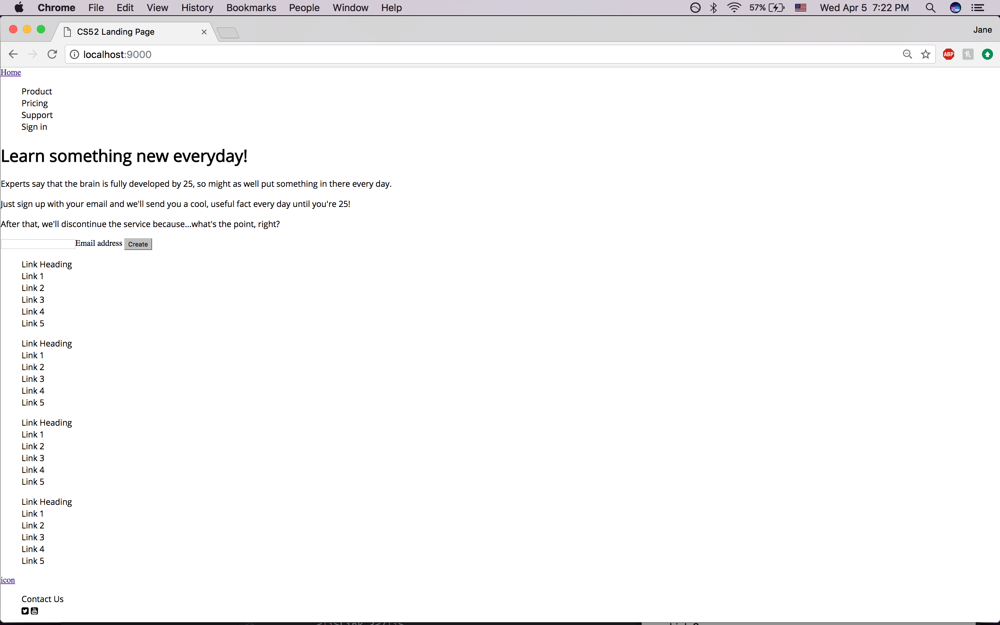
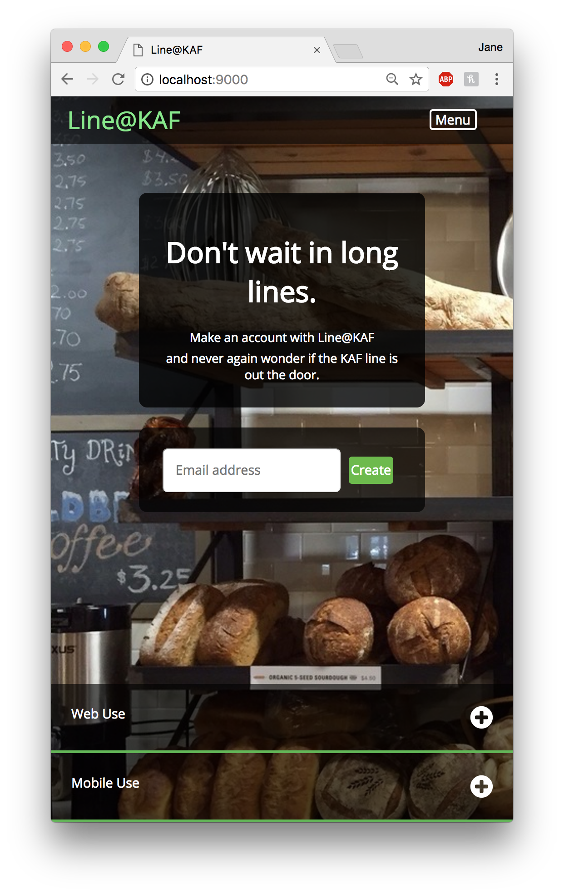
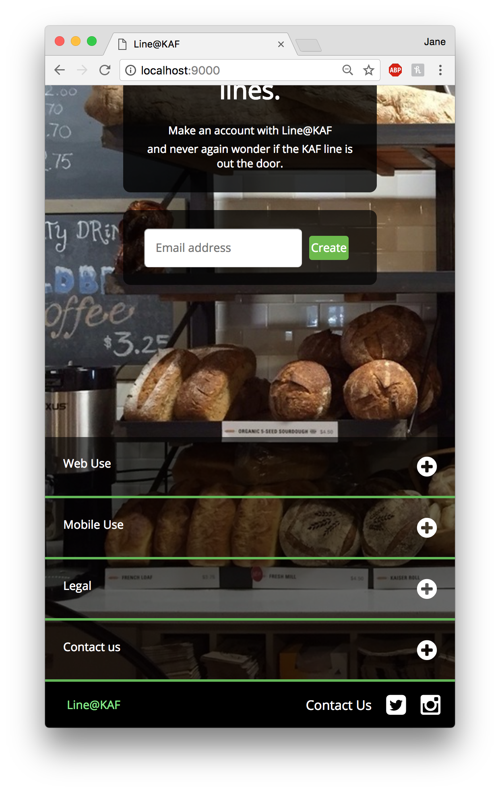

# README.md
Jane Lee

CS 52 Web-Dev with Tim Tregubov

## Description
I made this site in relation to the DALI project I'm working on: Line@KAF, and I used all the elements from the http://cs52.me/assignments/lab/landing-page/ assignment using pure HTML/CSS.  
The logo at the top nav bar has an empty link and the right menu options have a hover function on them.  The header section and the input section are each flex boxes and the email address section actually takes an input.  The create button has hover and has an animated push-down with a click.  The links at the bottom are like the nav bar menu options in that they have hover effects.  In the footer, there is another home logo, as well as a contact us, Facebook, and Instagram logo.  I used flex boxes for each of these components and flex boxes within those flex boxes to space elements out to imitate the one in the assignment.  

With a smaller window size/mobile view, the view changes.  The nav bar collapses and the links also collapse.  

The hardest part was figuring out margin and padding pixels for each component of the landing page because they had to fit together, but it would be hard to know what it looked like without reloading the page.  It was more of a guess and check, trial and error process.  

I tried doing the check boxes but it was difficult to implement in conjunction to display:none.  If I had more time, I would try to figure this part out so that the mobile version could have the menu and links options.  

## Screencaps

Here is a screen cap of the layout stage.  Please note that I changed the content of the webpage after styling it, so the text will be different.  

Here are screen caps of the finished product.

Here are screen caps of the mobile version.  I used media query to change the mobile layout to adjust to the size difference.  

